<p align="center">
   <a href="https://codigrate.com">
    
  </a>
</p>

<h1 align="center">
Codigrate Themes for Slack
</h1>

A carefully crafted collection of Slack color palettes inspired by nature and iconic cities around the world.
Each palette is adapted from Codigrate JetBrains themes and tuned for Slack's built-in custom theme format.

These themes do not require extensions, patches, or custom CSS. Copy a theme string from this repository and paste it
into Slack's custom theme field.

The themes marked **Premium** below are sold on [codigrate.com](https://codigrate.com) for a small one-time price; the
purchase delivers the theme string with the same install steps. The other themes are free, MIT licensed, right here.

## Getting Started

1. Open Slack.
2. Go to **Preferences | Appearance**.
3. Open **Themes**.
4. Choose **Create a custom theme**.
5. Copy one of the theme strings from a theme file in this repository.
6. Paste it into Slack's custom theme field.
7. In the same **Appearance** settings, choose **Light** or **Dark** mode to match the palette; in Dark mode, turn on **Darker sidebars**.

## Theme Format

Slack custom themes use four colors in this order:

```text
System Navigation, Selected Items, Presence Indication, Notifications
```

## Light and Dark Mode

Slack custom theme strings do not control Slack's light or dark mode. Set it in **Preferences | Appearance**.

Use **Light** mode for the light palettes and **Dark** mode for the dark ones. In Dark mode, turn on
**Darker sidebars** for a rich, readable sidebar.

If you switch between light and dark mode, restart Slack so the theme applies correctly.

## Nature

<p align="center">
   <a href="https://codigrate.com/theme?product=everest&category=nature">
      
   </a>
</p>

<h1 align="center">
   Everest
</h1>

## Description

Inspired by the icy terraces of Mount Everest and the first light breaking over its peaks, this theme pairs cool white and pale grey backgrounds with deep glacier blues and greens to create a clear and unhurried coding environment. Bright, airy surfaces keep the editor calm, while teals, forest greens, and a warm coral accent add definition and focus to key syntax elements.

## Screenshots

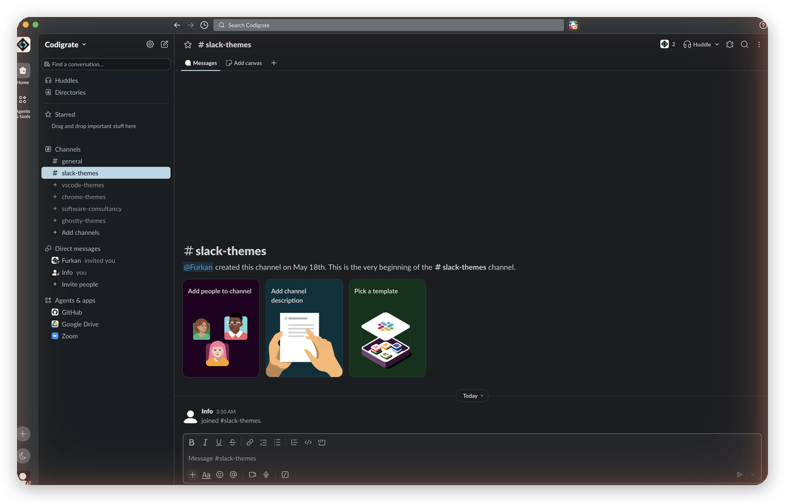

## Color Palette

<table>
   <tr>
      <td></td>
      <td>
         Ice Melt
      </td>
      <td>
         System Navigation
      </td>
      <td>
         <a href="https://codigrate.com/tools/color/CADAE0">#CADAE0</a>
      </td>
   </tr>
   <tr>
      <td></td>
      <td>
         Ice Melt
      </td>
      <td>
         Selected Items
      </td>
      <td>
         <a href="https://codigrate.com/tools/color/B6D8E5">#B6D8E5</a>
      </td>
   </tr>
   <tr>
      <td></td>
      <td>
         Alpenglow
      </td>
      <td>
         Presence Indication
      </td>
      <td>
         <a href="https://codigrate.com/tools/color/EC9C81">#EC9C81</a>
      </td>
   </tr>
   <tr>
      <td></td>
      <td>
         Deep Crevasse
      </td>
      <td>
         Notifications
      </td>
      <td>
         <a href="https://codigrate.com/tools/color/246A89">#246A89</a>
      </td>
   </tr>
</table>

---

<p align="center">
   <a href="https://codigrate.com/theme?product=aurora-borealis&category=nature">
      
   </a>
</p>

<h1 align="center">
   Aurora Borealis
</h1>

## Description

Inspired by the Arctic night sky and the slow drift of the Northern Lights, this theme blends deep navy and teal shadows with luminous blue and green accents to create a calm yet vivid coding environment. Dark, cool backgrounds keep the editor restful, while bright cyans, fresh greens, and soft lavenders add clarity and energy to key syntax elements.

## Screenshots

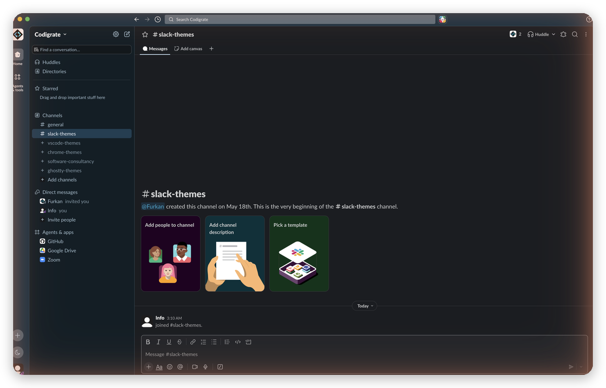

## Color Palette

<table>
   <tr>
      <td></td>
      <td>
         Glacial Shelf
      </td>
      <td>
         System Navigation
      </td>
      <td>
         <a href="https://codigrate.com/tools/color/1A3746">#1A3746</a>
      </td>
   </tr>
   <tr>
      <td></td>
      <td>
         Deep Fjord
      </td>
      <td>
         Selected Items
      </td>
      <td>
         <a href="https://codigrate.com/tools/color/1E3F53">#1E3F53</a>
      </td>
   </tr>
   <tr>
      <td></td>
      <td>
         Violet Curtain
      </td>
      <td>
         Presence Indication
      </td>
      <td>
         <a href="https://codigrate.com/tools/color/A55CC8">#A55CC8</a>
      </td>
   </tr>
   <tr>
      <td></td>
      <td>
         Arctic Cyan
      </td>
      <td>
         Notifications
      </td>
      <td>
         <a href="https://codigrate.com/tools/color/7AC6F5">#7AC6F5</a>
      </td>
   </tr>
</table>

---

<p align="center">
   <a href="https://codigrate.com/theme?product=sakura&category=nature">
      
   </a>
</p>

<h1 align="center">
   Sakura
</h1>

## Description

Inspired by cherry blossom season and the quiet gardens beneath it, this theme pairs pale petal backgrounds with deep rose and plum accents to create a soft and unhurried coding environment. Light, gentle surfaces keep the editor calm, while muted greens and clear sky blues add balance and focus to key syntax elements.

## Screenshots

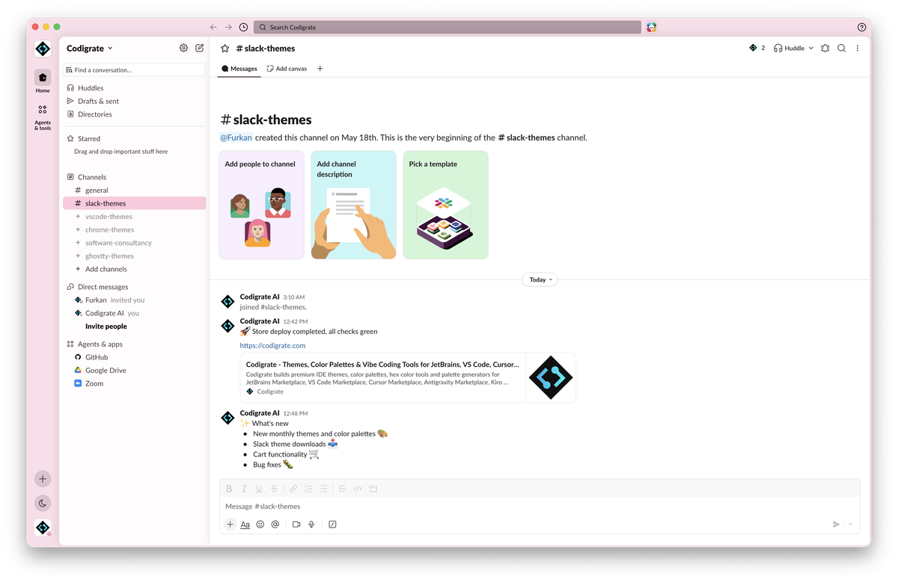

## Color Palette

<table>
   <tr>
      <td></td>
      <td>
         Petal Veil
      </td>
      <td>
         System Navigation
      </td>
      <td>
         <a href="https://codigrate.com/tools/color/F8DBE6">#F8DBE6</a>
      </td>
   </tr>
   <tr>
      <td></td>
      <td>
         Full Bloom
      </td>
      <td>
         Selected Items
      </td>
      <td>
         <a href="https://codigrate.com/tools/color/FFC9DC">#FFC9DC</a>
      </td>
   </tr>
   <tr>
      <td></td>
      <td>
         Blush Pink
      </td>
      <td>
         Presence Indication
      </td>
      <td>
         <a href="https://codigrate.com/tools/color/EFA5BF">#EFA5BF</a>
      </td>
   </tr>
   <tr>
      <td></td>
      <td>
         Deep Sakura
      </td>
      <td>
         Notifications
      </td>
      <td>
         <a href="https://codigrate.com/tools/color/B54B66">#B54B66</a>
      </td>
   </tr>
</table>

---

<p align="center">
   <a href="https://codigrate.com/theme?product=sequoia&category=nature">
      
   </a>
</p>

<h1 align="center">
   Sequoia
</h1>

## Description

Inspired by the towering stillness of a sequoia grove, this theme blends deep forest black and bark brown with living green and moss accents to create a grounded and focused coding environment. Dark, earthy backgrounds settle the editor, while warm tans, rusts, and a clear canopy green add contrast and clarity to key syntax elements.

## Screenshots

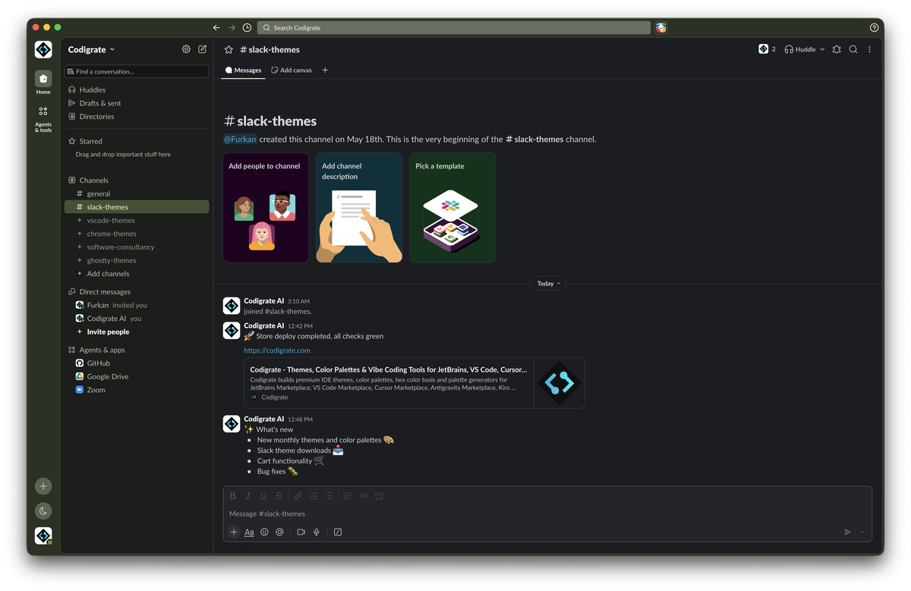

## Color Palette

<table>
   <tr>
      <td></td>
      <td>
         Evergreen Shade
      </td>
      <td>
         System Navigation
      </td>
      <td>
         <a href="https://codigrate.com/tools/color/394132">#394132</a>
      </td>
   </tr>
   <tr>
      <td></td>
      <td>
         Fern Shade
      </td>
      <td>
         Selected Items
      </td>
      <td>
         <a href="https://codigrate.com/tools/color/405133">#405133</a>
      </td>
   </tr>
   <tr>
      <td></td>
      <td>
         Olive Canopy
      </td>
      <td>
         Presence Indication
      </td>
      <td>
         <a href="https://codigrate.com/tools/color/788B40">#788B40</a>
      </td>
   </tr>
   <tr>
      <td></td>
      <td>
         Fresh Growth
      </td>
      <td>
         Notifications
      </td>
      <td>
         <a href="https://codigrate.com/tools/color/73A621">#73A621</a>
      </td>
   </tr>
</table>

---

<p align="center">
   <a href="https://codigrate.com/theme?product=autumn&category=nature">
      
   </a>
</p>

<h1 align="center">
   Autumn
</h1>

## Description

Inspired by fallen leaves and late afternoon sunlight, this theme blends soft parchment backgrounds with rust, copper, and harvest gold to create a warm and unhurried coding environment. Light, gentle surfaces keep the editor comfortable, while deep greens and a quiet teal add contrast and focus to key syntax elements.

## Screenshots

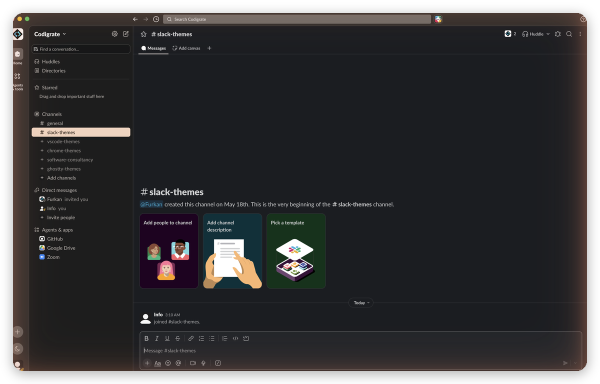

## Color Palette

<table>
   <tr>
      <td></td>
      <td>
         Sandstone
      </td>
      <td>
         System Navigation
      </td>
      <td>
         <a href="https://codigrate.com/tools/color/EFE6E0">#EFE6E0</a>
      </td>
   </tr>
   <tr>
      <td></td>
      <td>
         Apricot Haze
      </td>
      <td>
         Selected Items
      </td>
      <td>
         <a href="https://codigrate.com/tools/color/F4D3BD">#F4D3BD</a>
      </td>
   </tr>
   <tr>
      <td></td>
      <td>
         Golden Leaf
      </td>
      <td>
         Presence Indication
      </td>
      <td>
         <a href="https://codigrate.com/tools/color/DEA51D">#DEA51D</a>
      </td>
   </tr>
   <tr>
      <td></td>
      <td>
         Copper Leaf
      </td>
      <td>
         Notifications
      </td>
      <td>
         <a href="https://codigrate.com/tools/color/A7714C">#A7714C</a>
      </td>
   </tr>
</table>

---

<p align="center">
   <a href="https://codigrate.com/theme?product=roraima&category=nature">
      
   </a>
</p>

<h1 align="center">
   Roraima
</h1>

## Description

Inspired by the sunset over Mount Roraima and the slow turn from day to night on its tabletop summit, this theme blends deep brown and clay shadows with amber, gold, and salmon accents to create a soothing yet vivid coding environment. Dark, earthy backgrounds ground the editor, while soft violets and mineral yellows add contrast and focus to key syntax elements.

## Screenshots

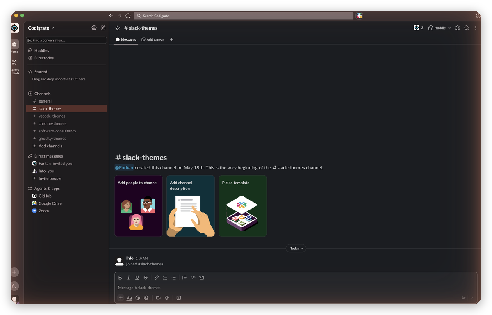

## Color Palette

<table>
   <tr>
      <td></td>
      <td>
         Canyon Shadow
      </td>
      <td>
         System Navigation
      </td>
      <td>
         <a href="https://codigrate.com/tools/color/372C2F">#372C2F</a>
      </td>
   </tr>
   <tr>
      <td></td>
      <td>
         Terracotta Shade
      </td>
      <td>
         Selected Items
      </td>
      <td>
         <a href="https://codigrate.com/tools/color/582F29">#582F29</a>
      </td>
   </tr>
   <tr>
      <td></td>
      <td>
         Orchid Mist
      </td>
      <td>
         Presence Indication
      </td>
      <td>
         <a href="https://codigrate.com/tools/color/8F78B7">#8F78B7</a>
      </td>
   </tr>
   <tr>
      <td></td>
      <td>
         Sunset Mesa
      </td>
      <td>
         Notifications
      </td>
      <td>
         <a href="https://codigrate.com/tools/color/CC654E">#CC654E</a>
      </td>
   </tr>
</table>

---

<p align="center">
   <a href="https://codigrate.com/theme?product=salda&platform=slack">
      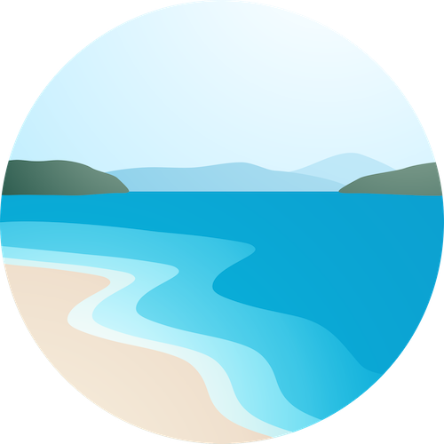
   </a>
</p>

<h1 align="center">
   Salda
   <br>
   (Premium)
</h1>

[](https://codigrate.com/theme?product=salda&platform=slack)

## Description

Inspired by the white shores and turquoise shallows of Lake Salda, this theme pairs warm sand and soft cream backgrounds with clear lagoon blues and teals to create a bright and unhurried coding environment. Pale, airy surfaces keep the editor calm, while lagoon blues, shaded teals, and a fresh reed green add definition and focus to key syntax elements.

## Screenshots

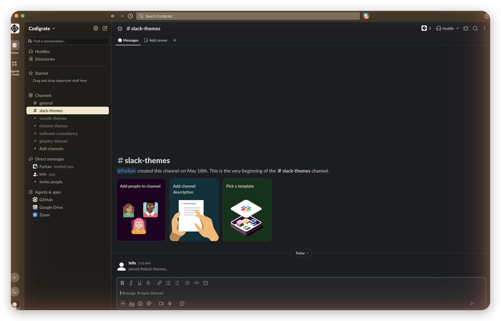

---

<p align="center">
   <a href="https://codigrate.com/theme?product=ocean&platform=slack">
      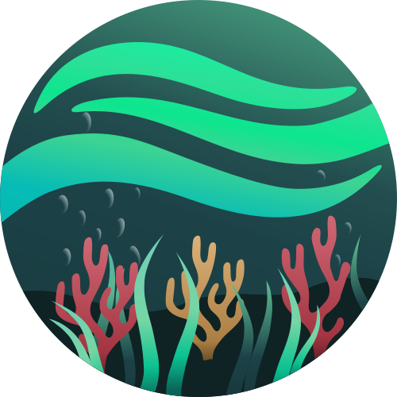
   </a>
</p>

<h1 align="center">
   Ocean
   <br>
   (Premium)
</h1>

[](https://codigrate.com/theme?product=ocean&platform=slack)

## Description

Inspired by the deep sea and the quiet glow of life far below the surface, this theme layers dark teal and blue-green shadows with bioluminescent cyan, coral pink, and sea glass accents to create a calm and immersive coding environment. Deep, cool backgrounds keep the editor restful, while bright cyans, soft pinks, and warm sandbar tones add clarity and focus to key syntax elements.

## Screenshots

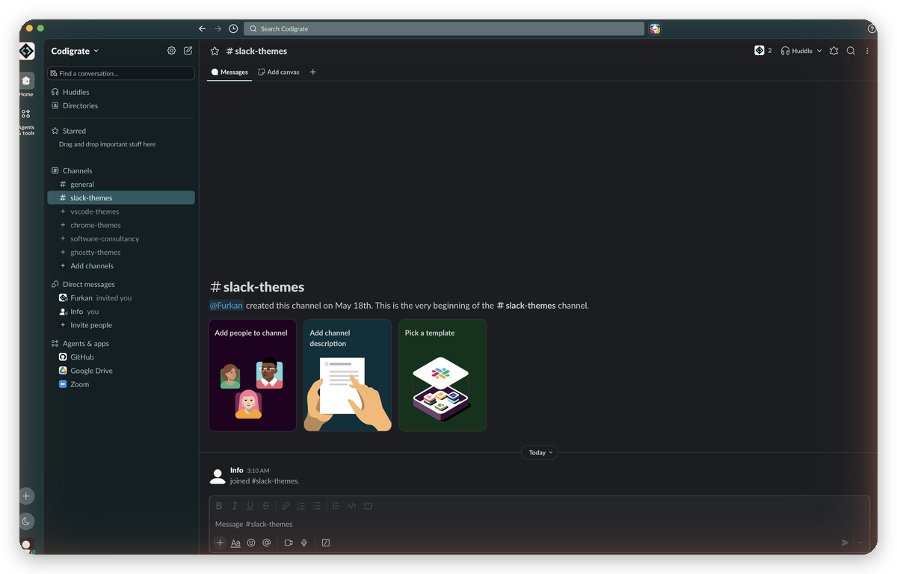

---

<p align="center">
   <a href="https://codigrate.com/theme?product=reynisfjara&platform=slack">
      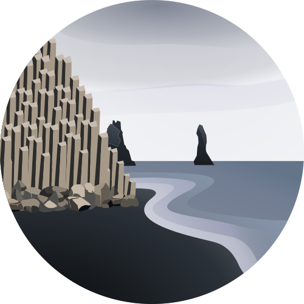
   </a>
</p>

<h1 align="center">
   Reynisfjara
   <br>
   (Premium)
</h1>

[](https://codigrate.com/theme?product=reynisfjara&platform=slack)

## Description

Inspired by the black sand of Reynisfjara at dusk, where basalt columns rise over the wet shore and the last light fades on the North Atlantic, this theme layers charcoal and slate shadows with driftwood, pebble, and bleached sand accents to create a calm and cinematic coding environment. Deep, muted backgrounds keep the editor restful, while warm timbers, pale driftwoods, and soft sands add clarity and focus to key syntax elements.

## Screenshots

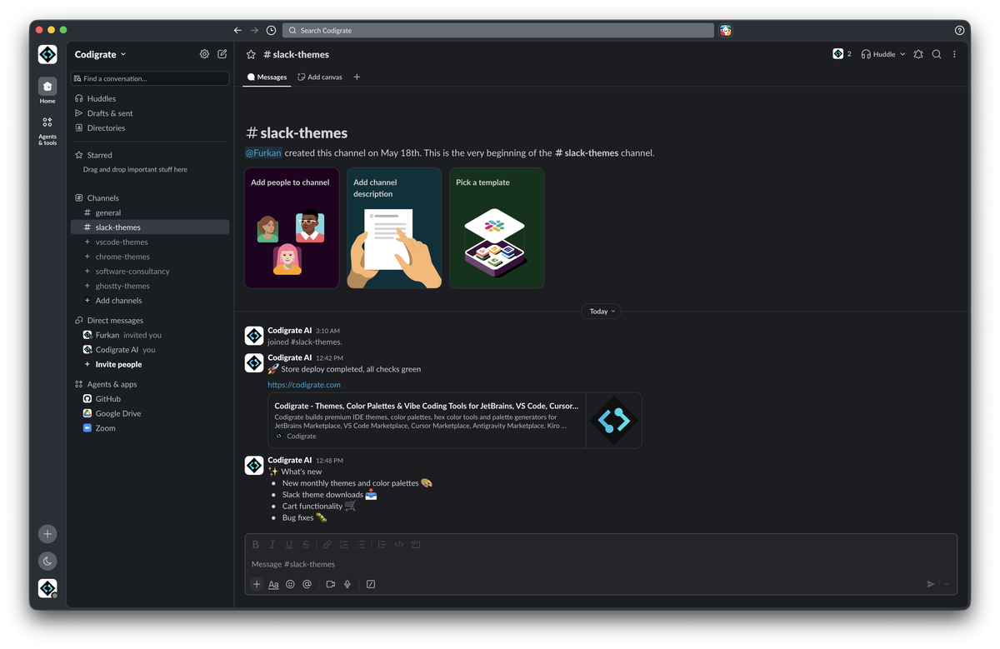

---

<p align="center">
   <a href="https://codigrate.com/theme?product=etna&platform=slack">
      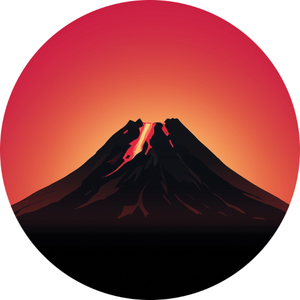
   </a>
</p>

<h1 align="center">
   Etna
   <br>
   (Premium)
</h1>

[](https://codigrate.com/theme?product=etna&platform=slack)

## Description

Inspired by Mount Etna's nighttime eruptions, this dark theme builds on an ashen basalt grey base and layers in the incandescent reds, oranges, and golds of molten lava. The near-neutral charcoal surface keeps long sessions calm, while the warm lava accents draw the eye to what matters.

## Screenshots

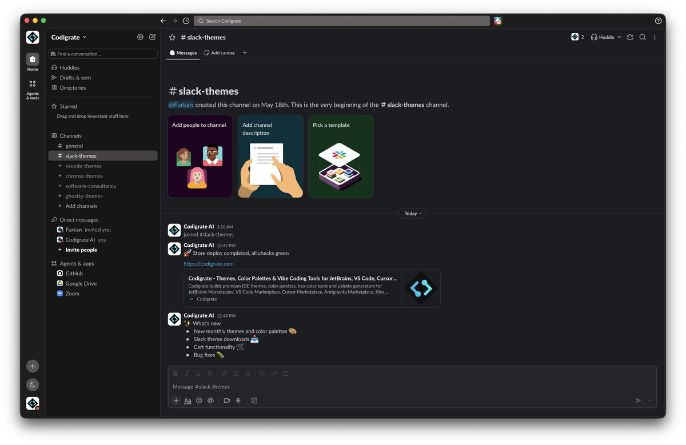

---

<p align="center">
   <a href="https://codigrate.com/theme?product=fuji&platform=slack">
      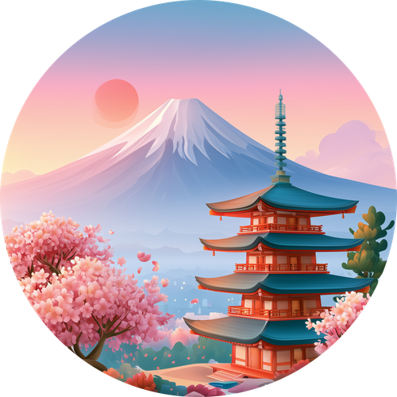
   </a>
</p>

<h1 align="center">
   Fuji
   <br>
   (Premium)
</h1>

[](https://codigrate.com/theme?product=fuji&platform=slack)

## Description

Inspired by Mount Fuji at first light, this light theme rests on the soft coral-peach glow of dawn over snow white, then lifts it with sakura pink and a lakeside torii's vermilion. The calm dawn surface keeps long sessions easy on the eyes while the blossom accents mark what matters.

## Screenshots

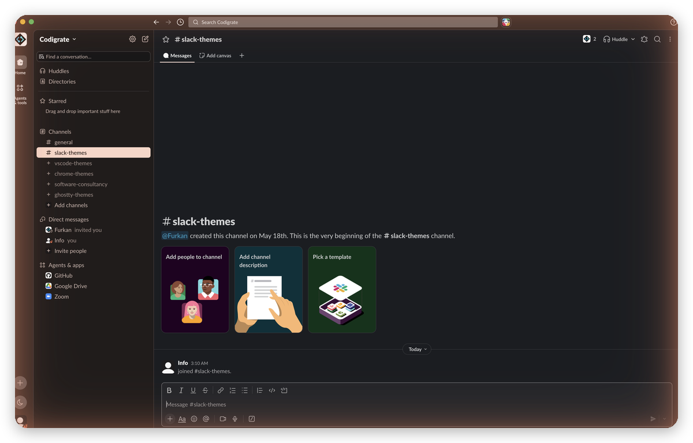

---

<p align="center">
   <a href="https://codigrate.com/theme?product=spring&platform=slack">
      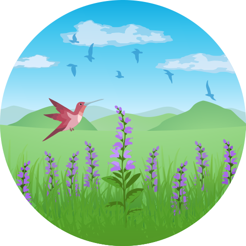
   </a>
</p>

<h1 align="center">
   Spring
   <br>
   (Premium)
</h1>

[](https://codigrate.com/theme?product=spring&platform=slack)

## Description

Inspired by a spring garden in full bloom, from tulip beds and crocus to the first new grass under a clear sky, this theme pairs airy mint and soft green backgrounds with foxglove, violet, and cornflower accents to create a fresh and unhurried coding environment. Bright, open surfaces keep the editor calm, while clover greens, crocus violets, and robin egg blues add definition and focus to key syntax elements.

## Screenshots

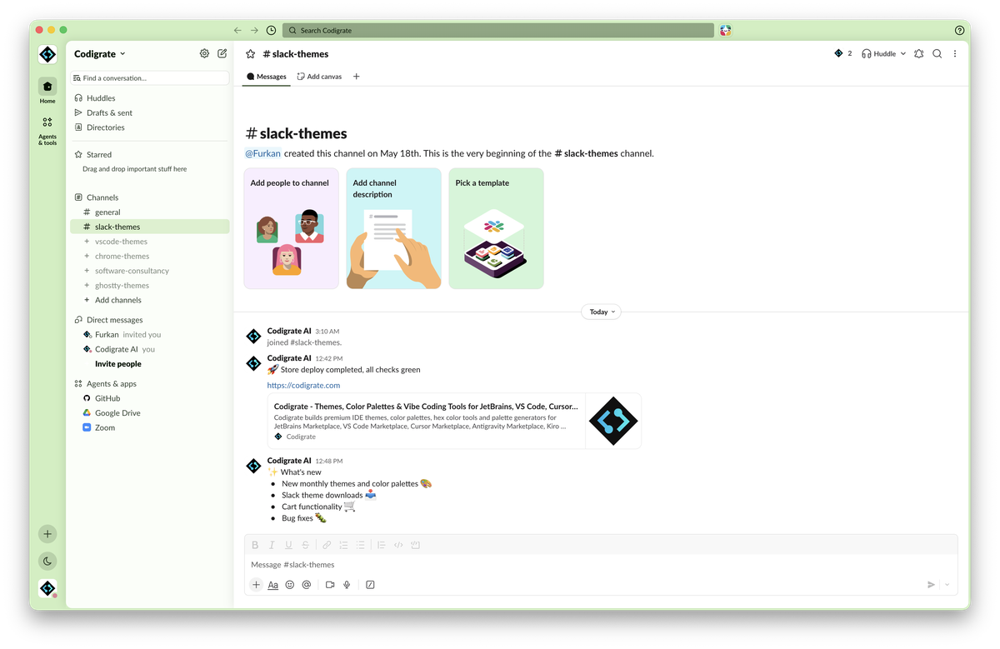

## Cities

<p align="center">
   <a href="https://codigrate.com/theme?product=istanbul&category=cities">
      
   </a>
</p>

<h1 align="center">
   Istanbul
</h1>

## Description

Inspired by the soft daylight and sea breezes of Istanbul, this theme blends calm turquoise tones with warm historical accents to create a serene yet expressive coding environment. Light, airy backgrounds keep the editor clean and comfortable, while teals, aquas, and muted golden hues add clarity and focus to essential syntax elements.

## Screenshots

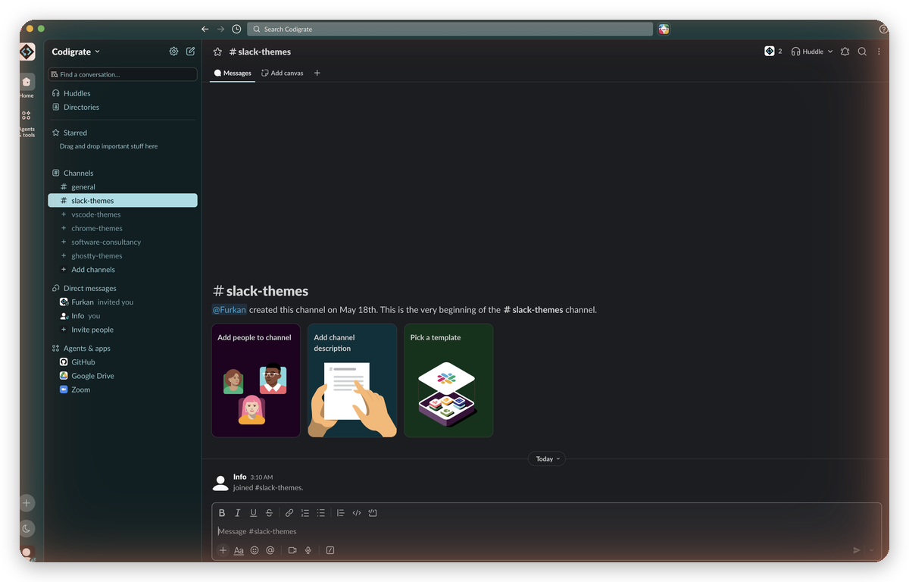

## Color Palette

<table>
   <tr>
      <td></td>
      <td>
         Turquoise Tile
      </td>
      <td>
         System Navigation
      </td>
      <td>
         <a href="https://codigrate.com/tools/color/91D1DA">#91D1DA</a>
      </td>
   </tr>
   <tr>
      <td></td>
      <td>
         Sea Glass
      </td>
      <td>
         Selected Items
      </td>
      <td>
         <a href="https://codigrate.com/tools/color/A3DDE5">#A3DDE5</a>
      </td>
   </tr>
   <tr>
      <td></td>
      <td>
         Iznik Turquoise
      </td>
      <td>
         Presence Indication
      </td>
      <td>
         <a href="https://codigrate.com/tools/color/12ACC1">#12ACC1</a>
      </td>
   </tr>
   <tr>
      <td></td>
      <td>
         Deep Bosphorus
      </td>
      <td>
         Notifications
      </td>
      <td>
         <a href="https://codigrate.com/tools/color/087E8E">#087E8E</a>
      </td>
   </tr>
</table>

---

<p align="center">
   <a href="https://codigrate.com/theme?product=miami&category=cities">
      
   </a>
</p>

<h1 align="center">
   Miami
</h1>

## Description

Inspired by the electric nights and pastel sunsets of Miami, this theme blends deep purples with vibrant neon accents to create a bold yet balanced coding environment. Dark, warm backgrounds ground the editor, while vivid pinks, corals, and tropical teals bring energy and clarity to key syntax elements.

## Screenshots

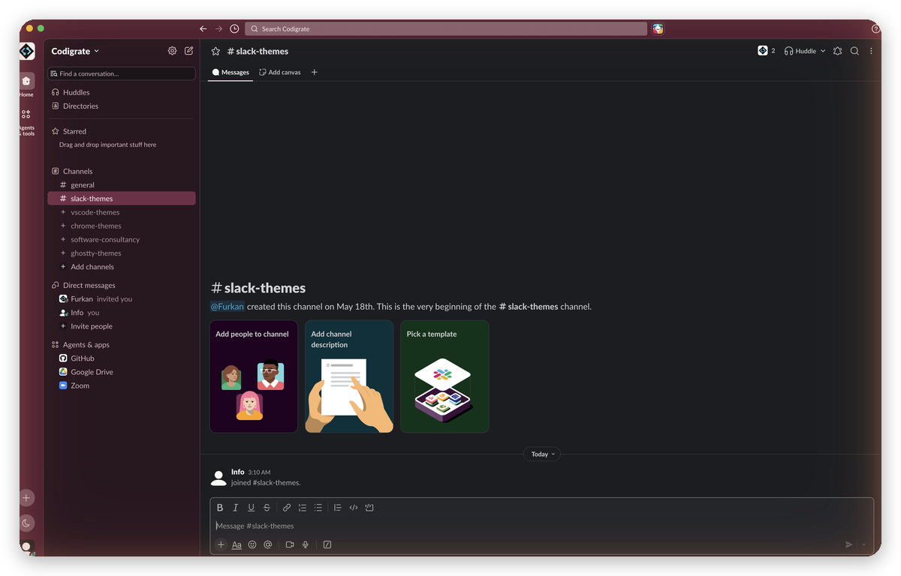

## Color Palette

<table>
   <tr>
      <td></td>
      <td>
         Plum Night
      </td>
      <td>
         System Navigation
      </td>
      <td>
         <a href="https://codigrate.com/tools/color/5D263A">#5D263A</a>
      </td>
   </tr>
   <tr>
      <td></td>
      <td>
         Berry Crush
      </td>
      <td>
         Selected Items
      </td>
      <td>
         <a href="https://codigrate.com/tools/color/722E47">#722E47</a>
      </td>
   </tr>
   <tr>
      <td></td>
      <td>
         Electric Aqua
      </td>
      <td>
         Presence Indication
      </td>
      <td>
         <a href="https://codigrate.com/tools/color/17C7AC">#17C7AC</a>
      </td>
   </tr>
   <tr>
      <td></td>
      <td>
         Miami Pink
      </td>
      <td>
         Notifications
      </td>
      <td>
         <a href="https://codigrate.com/tools/color/FF5FA2">#FF5FA2</a>
      </td>
   </tr>
</table>

---

<p align="center">
   <a href="https://codigrate.com/theme?product=rio-de-janeiro&category=cities">
      
   </a>
</p>

<h1 align="center">
   Rio de Janeiro
</h1>

## Description

Inspired by Rio's lush hills, soft morning light, and ocean air, this theme blends airy minty backgrounds with confident rainforest greens and clean coastal blues. The editor stays bright and calm for long sessions, while crisp greens and balanced accents keep syntax readable and focused.

## Screenshots

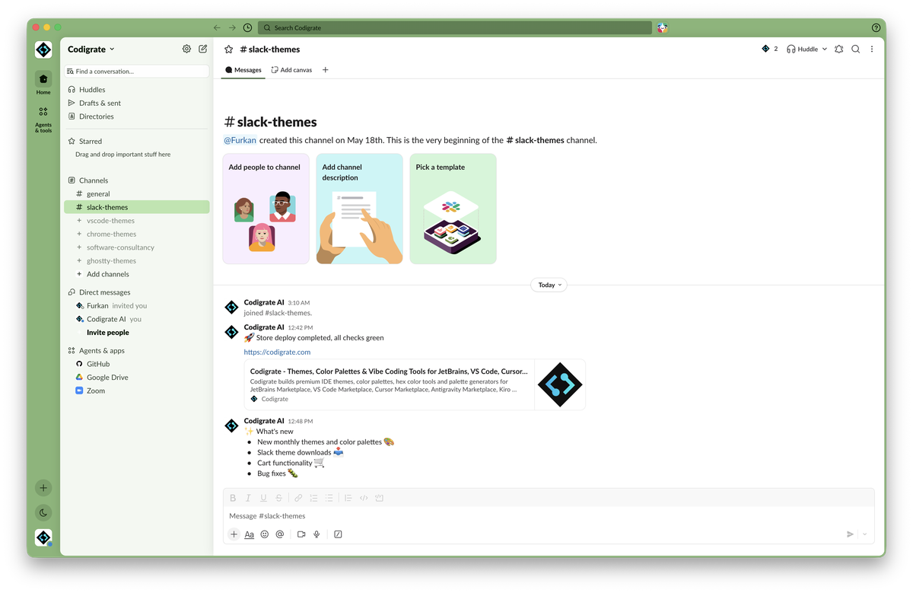

## Color Palette

<table>
   <tr>
      <td></td>
      <td>
         Jungle Canopy
      </td>
      <td>
         System Navigation
      </td>
      <td>
         <a href="https://codigrate.com/tools/color/85B778">#85B778</a>
      </td>
   </tr>
   <tr>
      <td></td>
      <td>
         Garden Path
      </td>
      <td>
         Selected Items
      </td>
      <td>
         <a href="https://codigrate.com/tools/color/B8E5AD">#B8E5AD</a>
      </td>
   </tr>
   <tr>
      <td></td>
      <td>
         Guanabara Blue
      </td>
      <td>
         Presence Indication
      </td>
      <td>
         <a href="https://codigrate.com/tools/color/2287D5">#2287D5</a>
      </td>
   </tr>
   <tr>
      <td></td>
      <td>
         Rainforest
      </td>
      <td>
         Notifications
      </td>
      <td>
         <a href="https://codigrate.com/tools/color/375B2E">#375B2E</a>
      </td>
   </tr>
</table>

---

<p align="center">
   <a href="https://codigrate.com/theme?product=paris&category=cities">
      
   </a>
</p>

<h1 align="center">
   Paris
</h1>

## Description

Inspired by elegant boulevards and Paris's sunset glow, this theme trades bright champagne for dusty rose accents over calm plum-espresso tones. Soft dark editor backgrounds keep focus clear, while mauve surfaces and wine-tinted hovers add depth and balance, with a gentle blush accent guiding attention across the interface.

## Screenshots

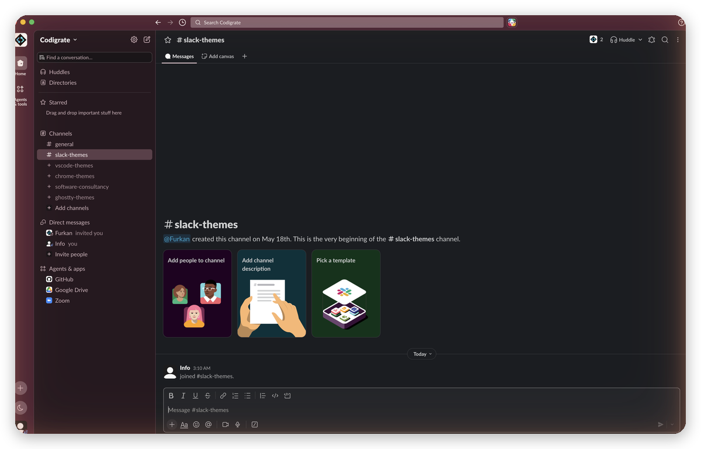

## Color Palette

<table>
   <tr>
      <td></td>
      <td>
         Rosewood
      </td>
      <td>
         System Navigation
      </td>
      <td>
         <a href="https://codigrate.com/tools/color/6A3C4D">#6A3C4D</a>
      </td>
   </tr>
   <tr>
      <td></td>
      <td>
         Mauve Salon
      </td>
      <td>
         Selected Items
      </td>
      <td>
         <a href="https://codigrate.com/tools/color/5D3F49">#5D3F49</a>
      </td>
   </tr>
   <tr>
      <td></td>
      <td>
         Seine Blue
      </td>
      <td>
         Presence Indication
      </td>
      <td>
         <a href="https://codigrate.com/tools/color/5E7BB3">#5E7BB3</a>
      </td>
   </tr>
   <tr>
      <td></td>
      <td>
         Montmartre Rose
      </td>
      <td>
         Notifications
      </td>
      <td>
         <a href="https://codigrate.com/tools/color/D18FA8">#D18FA8</a>
      </td>
   </tr>
</table>

---

<p align="center">
   <a href="https://codigrate.com/theme?product=tallinn&category=cities">
      
   </a>
</p>

<h1 align="center">
   Tallinn
</h1>

## Description

Inspired by Tallinn's crisp light and Baltic calm, this theme pairs airy porcelain backgrounds with cool Nordic blues for a clean, focused coding experience. Soft, bright surfaces enhance readability, while deep ink accents and subtle lavender-rose highlights add clarity and warmth without losing the chill vibe.

## Screenshots

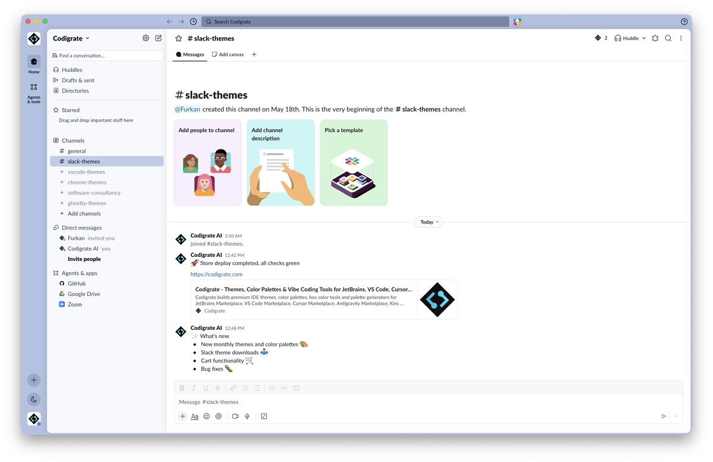

## Color Palette

<table>
   <tr>
      <td></td>
      <td>
         Limestone Blue
      </td>
      <td>
         System Navigation
      </td>
      <td>
         <a href="https://codigrate.com/tools/color/A9B9DA">#A9B9DA</a>
      </td>
   </tr>
   <tr>
      <td></td>
      <td>
         Winter Sky
      </td>
      <td>
         Selected Items
      </td>
      <td>
         <a href="https://codigrate.com/tools/color/BECCEC">#BECCEC</a>
      </td>
   </tr>
   <tr>
      <td></td>
      <td>
         Periwinkle
      </td>
      <td>
         Presence Indication
      </td>
      <td>
         <a href="https://codigrate.com/tools/color/7179CC">#7179CC</a>
      </td>
   </tr>
   <tr>
      <td></td>
      <td>
         Old Town Indigo
      </td>
      <td>
         Notifications
      </td>
      <td>
         <a href="https://codigrate.com/tools/color/3F4494">#3F4494</a>
      </td>
   </tr>
</table>

---

<p align="center">
   <a href="https://codigrate.com/theme?product=tokyo&category=cities">
      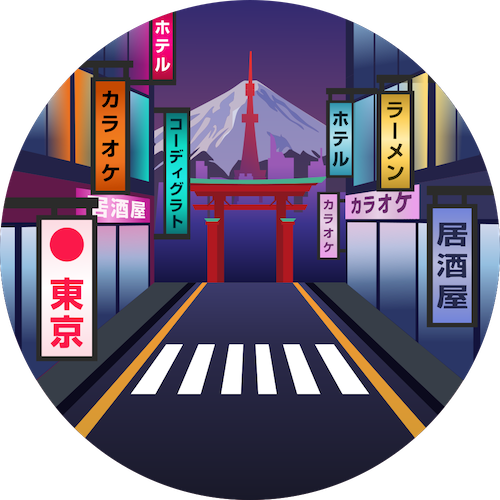
   </a>
</p>

<h1 align="center">
   Tokyo
</h1>

## Description

Inspired by Tokyo's neon-lit side streets, midnight skylines, and the quiet glow of lantern-lined alleys, this theme blends deep indigo shadows with electric violet highlights to create a sleek, futuristic coding atmosphere. Moody blues keep the editor calm and focused, while luminous purples, soft lilacs, and crisp cyan accents add clarity and energy to key syntax elements.

## Screenshots

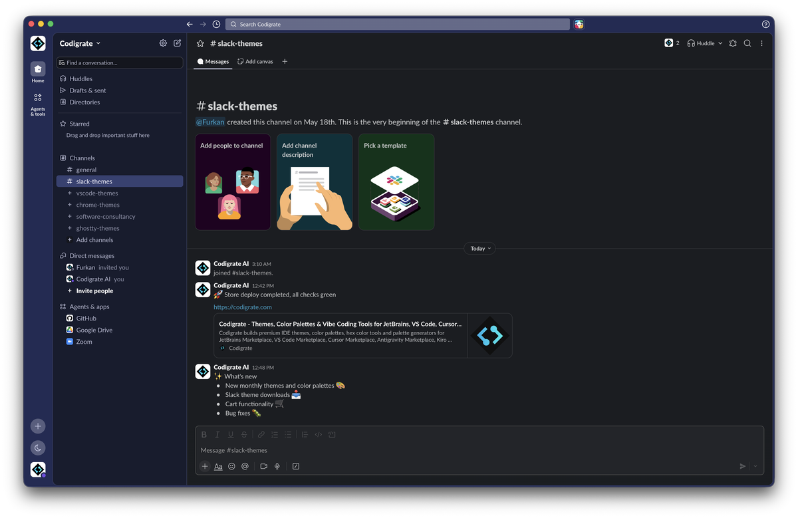

## Color Palette

<table>
   <tr>
      <td></td>
      <td>
         Indigo District
      </td>
      <td>
         System Navigation
      </td>
      <td>
         <a href="https://codigrate.com/tools/color/323B66">#323B66</a>
      </td>
   </tr>
   <tr>
      <td></td>
      <td>
         Indigo District
      </td>
      <td>
         Selected Items
      </td>
      <td>
         <a href="https://codigrate.com/tools/color/354172">#354172</a>
      </td>
   </tr>
   <tr>
      <td></td>
      <td>
         Ultraviolet
      </td>
      <td>
         Presence Indication
      </td>
      <td>
         <a href="https://codigrate.com/tools/color/714CE3">#714CE3</a>
      </td>
   </tr>
   <tr>
      <td></td>
      <td>
         Shibuya Blue
      </td>
      <td>
         Notifications
      </td>
      <td>
         <a href="https://codigrate.com/tools/color/7285DC">#7285DC</a>
      </td>
   </tr>
</table>

---

<p align="center">
   <a href="https://codigrate.com/theme?product=sydney&platform=slack">
      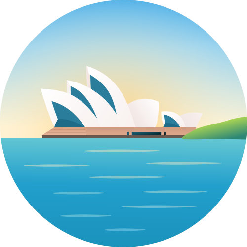
   </a>
</p>

<h1 align="center">
   Sydney
   <br>
   (Premium)
</h1>

[](https://codigrate.com/theme?product=sydney&platform=slack)

## Description

Inspired by Sydney Harbour at midday, from the white sails of the Opera House to the sandstone glowing along the shore, this theme pairs airy white and pale mist backgrounds with harbour blues, jade teals, and outback golds to create a bright and vibrant coding environment. Light, open surfaces keep the editor clear, while Pacific blues, warm coppers, and desert clays add definition and focus to key syntax elements.

## Screenshots

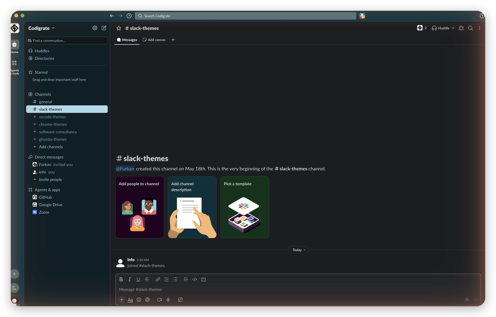

---

<p align="center">
   <a href="https://codigrate.com/theme?product=prague&platform=slack">
      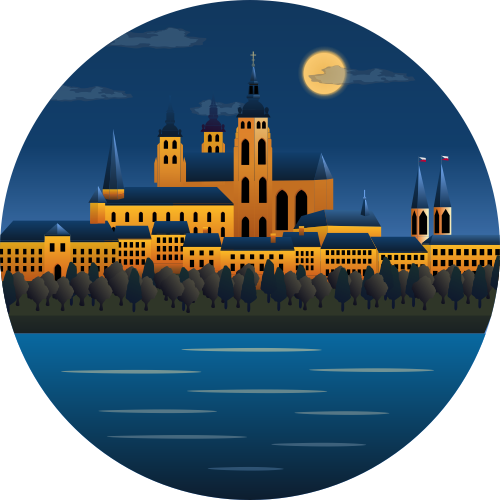
   </a>
</p>

<h1 align="center">
   Prague
   <br>
   (Premium)
</h1>

[](https://codigrate.com/theme?product=prague&platform=slack)

## Description

Inspired by Prague after dark, from the deep blues of the Vltava to the gas lamps glowing along its bridges, this theme layers midnight navy and castle blue shadows with amber, copper, and straw gold accents to create a warm and cinematic coding environment. Deep, cool backgrounds keep the editor restful, while pale river blues, lantern ambers, and rooftop coppers add clarity and focus to key syntax elements.

## Screenshots

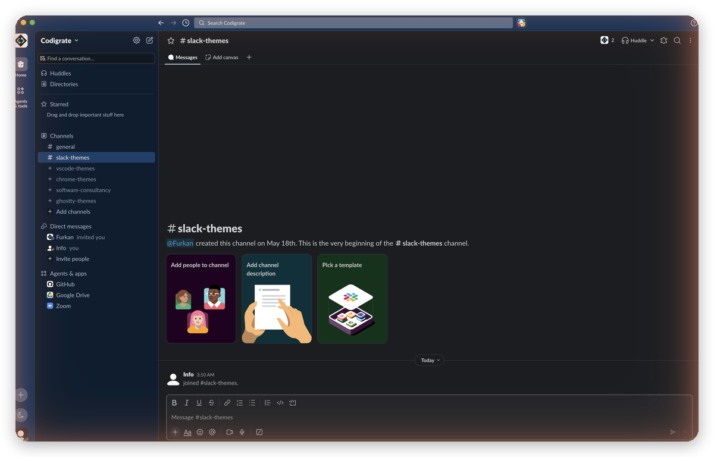

---

<p align="center">
   <a href="https://codigrate.com/theme?product=vienna&platform=slack">
      
   </a>
</p>

<h1 align="center">
   Vienna
   <br>
   (Premium)
</h1>

[](https://codigrate.com/theme?product=vienna&platform=slack)

## Description

Inspired by a Viennese evening at the opera, from velvet seats and candlelit boxes to gilded balconies and the sheet music on the stands, this theme layers mahogany and crimson shadows with imperial gold, candlelight, and marzipan accents to create a warm and cinematic coding environment. Deep, rich backgrounds keep the editor restful, while golds, pastry creams, and palace olives add clarity and focus to key syntax elements.

## Screenshots

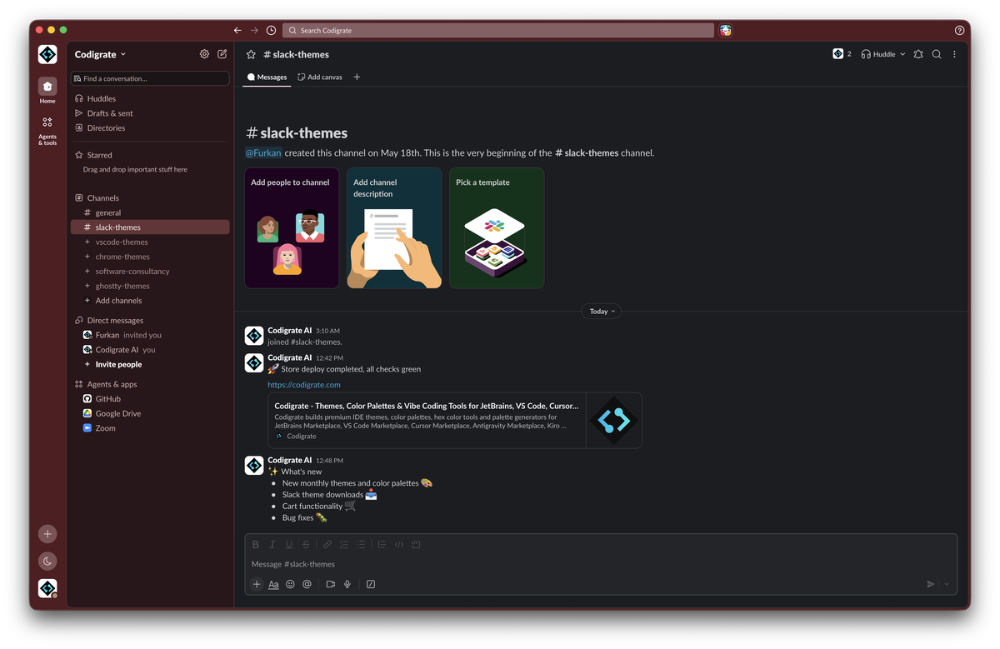

---

<p align="center">
   <a href="https://codigrate.com/theme?product=madrid&platform=slack">
      
   </a>
</p>

<h1 align="center">
   Madrid
   <br>
   (Premium)
</h1>

[](https://codigrate.com/theme?product=madrid&platform=slack)

## Description

Inspired by a Madrid balcony at midday, from sunlit facades and saffron awnings to the claveles spilling over the railings, this theme pairs warm golden and cream backgrounds with flamenco reds, sangria, and azulejo blues to create a bright and vibrant coding environment. Light, sun-warmed surfaces keep the editor clear, while Toledo golds, Spanish reds, and Andalusian teals add definition and focus to key syntax elements.

## Screenshots

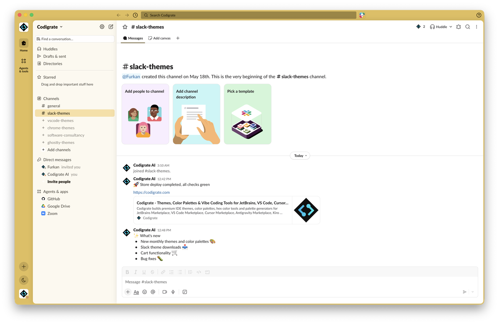

---

<p align="center">
   <a href="https://codigrate.com/theme?product=london&platform=slack">
      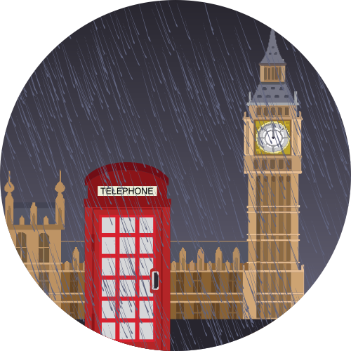
   </a>
</p>

<h1 align="center">
   London
   <br>
   (Premium)
</h1>

[](https://codigrate.com/theme?product=london&platform=slack)

## Description

Inspired by London at dusk, this dark theme rests on a slate grey base washed with twilight indigo, then lights it with the pillar box red of a K6 telephone box and the muted steel blue of the Thames. The calm grey surface keeps long sessions easy on the eyes while the red accents mark what matters.

## Screenshots

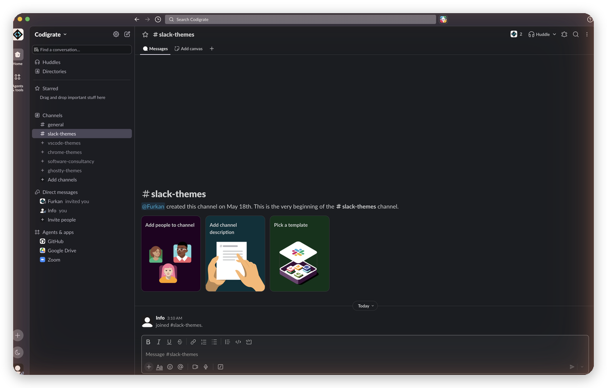

<!-- codigrate-readme-footer -->

## Contributing

Issues and suggestions are welcome. Open an issue on this repository, or reach us at [info@codigrate.com](mailto:info@codigrate.com).

## Contributors

<a href="https://github.com/codigrate/slack-themes/graphs/contributors">
   
</a>

## License

The source code for this project is released under the [MIT License](LICENSE).

## Codigrate

Themes, color tools and developer experience products from [Codigrate](https://codigrate.com).

<p align="center">
   <a href="https://codigrate.com/themes">All Themes</a> ·
   <a href="https://codigrate.com/tools">Color Tools</a> ·
   <a href="https://codigrate.com/plugins">Plugins</a> ·
   <a href="https://codigrate.com/blog">Blog</a> ·
   <a href="https://github.com/codigrate">GitHub</a>
</p>

<table align="right"><tr><td><a href="https://codigrate.com"></a></td><td><b>Codigrate © 2026</b></td></tr></table>
